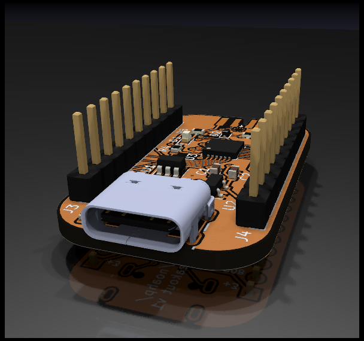

[](https://github.com/noahp/samd11-breakout)
[](https://github.com/noahp/samd11-breakout/actions)

# samd11 breakout

Little breakout for some spare samd11's.

Trying out https://debug-edge.io/ .

[Schematic PDF](hw/samd11-breakout.pdf)



## partlist

- usb c receptacle : https://octopart.com/search?q=usb4105
- DebugEdge connector : https://octopart.com/search?q=009159006061916
- arm debug cable : https://www.digikey.com/short/4cw7nq
- TVS diode : https://www.digikey.com/en/products/detail/stmicroelectronics/USBLC6-2SC6/1040559
- USB VSENSE diode : https://www.digikey.com/en/products/detail/on-semiconductor/BAT54XV2T1G/918321

Octopart bom with bonus arm connector and flux:

- https://octopart.com/bom-tool/GsivXDSs

## project directory structure

```bash
.
├── Dockerfile  # tests run inside this
├── hw  # hardware design files
│   ├── fp-lib-table
│   ├── GCT_USB4105-GF-A.kicad_mod  # USB connector footprint
│   ├── samd11-breakout_3d_afterdark.png  # render
│   ├── samd11-breakout_3d.png  # render
│   ├── samd11-breakout-cache.lib
│   ├── samd11-breakout-ibom.html  # saved copy of interactive BOM
│   ├── samd11-breakout.kibot.yaml  # kibot config file
│   ├── samd11-breakout.kicad_pcb
│   ├── samd11-breakout.pdf  # schematic PDF
│   ├── samd11-breakout.pro  # kicad project
│   ├── samd11-breakout.sch
│   ├── sym-lib-table
│   ├── thirdparty/  # some thirdpart libraries used for the hardware
│   ├── USB4105-GF-A.lib  # USB connector kicad lib
│   └── USB4105-GF-A.step  # USB connector 3d model
├── README.md
├── sw  # software
│   ├── samd11-breakout.atstart  # project file for https://start.atmel.com/
│   └── samd11-breakout.atzip   # unpacked example system downloaded from above
└── test.sh  # test script; builds docker image and runs tests in the container
```

## software

At the moment I'm just using the preset application with USB CDC, downloaded and
unpacked into the directory described above.
