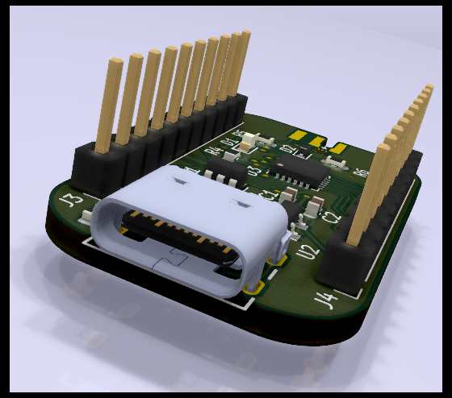

# samd11 breakout

Trying out https://debug-edge.io/ .

## partlist

- usb c receptacle : https://octopart.com/search?q=usb4105
- DebugEdge connector : https://octopart.com/search?q=009159006061916
- arm debug cable : https://www.digikey.com/short/4cw7nq
- TVS diode : https://www.digikey.com/en/products/detail/stmicroelectronics/USBLC6-2SC6/1040559
- USB VSENSE diode : https://www.digikey.com/en/products/detail/on-semiconductor/BAT54XV2T1G/918321

Octopart bom with bonus arm connector and flux:

- https://octopart.com/bom-tool/GsivXDSs
